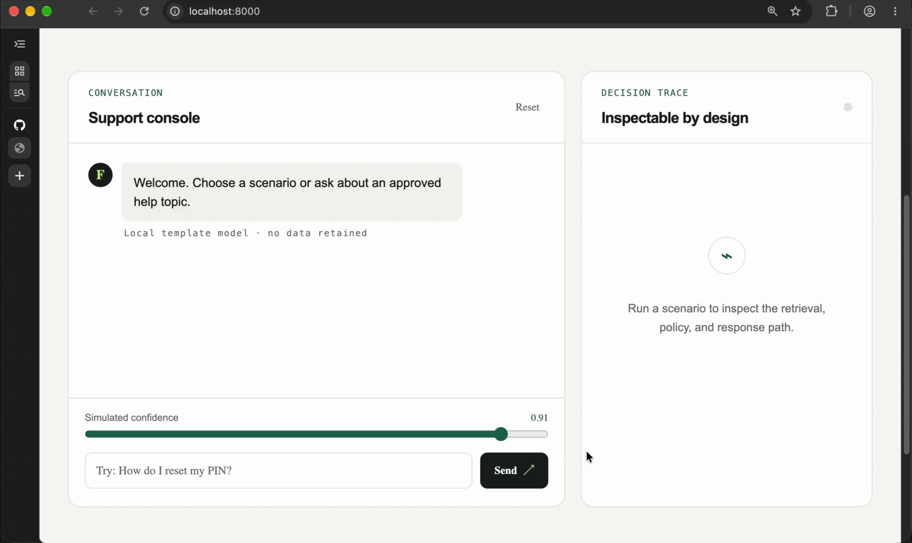

# FinVoice AI

[](https://github.com/moseskim1027/finvoice-ai/actions/workflows/ci.yml)
[](LICENSE)

FinVoice AI is a research-to-production portfolio project for a bilingual
financial-support voice and text agent. It is designed to demonstrate speech
AI, grounded response systems, safe tool use, human escalation, evaluation,
observability, and inference-cost engineering in one coherent system.

The repository combines production-style service boundaries with reproducible
applied-research evidence:

- a deployable, observable support service with explicit safety boundaries;
- a reproducible speech and language evaluation suite;
- a publication-style study of robustness, calibration, and escalation;
- measurable quality, latency, reliability, and cost tradeoffs.

## What is included

| Area | Implementation and evidence |
| --- | --- |
| Support service | FastAPI conversation and audio endpoints, deterministic policy, grounded responses, citations, and safe escalation |
| Speech | Bounded PCM WAV ingestion, energy VAD, optional Faster Whisper, governed benchmark, and WER/CER reporting |
| Streaming | Ordered chunks, endpointing, simulated partials, interruption, limits, and WebSocket transport |
| Tools | MCP server, fixed synthetic tool registry, authentication/scope/confirmation policy, and audit events |
| Research | Transcript, acoustic, and fusion baselines; calibration, abstention, ablations, slices, and bootstrap intervals |
| Operations | Correlated JSON logs, OpenTelemetry spans, bounded metrics, readiness, fault injection, SLOs, and load/cost evidence |

The default providers are local and deterministic, so the complete behavioral
and safety suite runs without external services. Optional Faster Whisper
evaluation is isolated behind an extra dependency and Docker profile.

## Research question

> Does combining acoustic embeddings with transcript features improve support
> intent classification and escalation decisions under noisy, accented, and
> code-switched speech, and can calibrated abstention reduce harmful errors?

This question keeps the research contribution tied to a real operational
decision. A model should not merely classify a conversation; it should know
when confidence is too low and transfer the case safely.

The first reproducible baseline study found no multimodal improvement on its
small synthetic held-out set: late fusion selected text only, while feature
concatenation underperformed the transcript model. See the
[multimodal intent study](docs/multimodal-intent-study.md) for methods, results,
calibration findings, and limitations.

The operability layer adds correlated JSON logs, bounded service
metrics, OpenTelemetry spans, health/readiness checks, fault injection, and a
deterministic load/cost benchmark. See the
[production evidence](docs/production-evidence.md),
[service objectives](docs/service-slos.md), and
[scripted demo](docs/demo-runbook.md). These artifacts describe a local
portfolio environment only and do not imply real-bank connectivity.

## System architecture

```text
 Text request          WAV upload          PCM chunks          MCP call
      |                    |                    |                  |
      v                    v                    v                  v
 [FastAPI route]    [WAV + VAD + ASR]   [stream session]   [tool gateway]
      |                    |                    |            auth / confirm
      +--------------------+--------------------+------------------+
                           |
                           v
                  [conversation service]
                  policy / confidence
                           |
               +-----------+-----------+
               |                       |
               v                       v
       [BM25 approved docs]      [safe escalation]
       citations + validation
               |
               v
       [deterministic response]

 Correlation context -> JSON logs + bounded metrics + OpenTelemetry spans
 Versioned evaluations -> CI tests + aggregate research/operations reports
```

The current implementation provides a transport-independent conversation
service, typed ports for retrieval, generation, policy, and storage, a
repository-controlled Markdown knowledge base, deterministic BM25 retrieval,
citation validation, and safe escalation for missing context or unavailable
providers. The speech path validates PCM WAV uploads, detects voice activity,
exposes a replaceable ASR provider, and reports WER/CER metrics. A deterministic
streaming layer adds ordered chunk ingestion, endpointing, partial/final events,
bounded session state, and response interruption. Correlated logs, metrics, and
OpenTelemetry spans cover the critical local paths. A standalone MCP server
exposes synthetic demo tools through the official stable
[MCP Python SDK](https://py.sdk.modelcontextprotocol.io/).

## Current orchestration boundary

```text
[FastAPI route]
      |
      v
[Conversation service]
      |
      +----> [Safety policy]
      |
      +----> [Retriever port]
      |             |
      |             v
      |       approved context
      |
      +----> [Generator port]
      |             |
      |             v
      |       grounded answer
      |
      +----> [Citation metadata]
      |
      +----> [Conversation store]
      |
      v
[Typed API response]
 request ID / decision / reason / confidence
 citations / provider metadata
```

All four provider boundaries are structural Python protocols. Deterministic
local implementations allow the full flow to run in tests without network
access or an external model. Provider implementations may signal a bounded
`ProviderUnavailableError`; the service converts it to a safe human escalation
instead of leaking an exception through the API.

## Grounded retrieval

The current baseline keeps approved content as version-controlled Markdown and
ranks it with BM25. It is deliberately small and inspectable so later vector or
hybrid implementations can be evaluated against identical contracts and cases.

```text
[Approved Markdown]
        |
        v
[Document loader]
 title / body / stable ID / source path
        |
        v
[BM25 index]
 tokenization / term frequency / length normalization
        |
        v
[Ranked context]
 score threshold / top-k
        |
        v
[Response generator]
 answer + cited document IDs
        |
        v
[Citation validator]
 cited IDs must be present in retrieved context
        |
   +----+----+
   |         |
 valid     invalid
   |         |
   v         v
[response] [safe escalation]
```

Run the offline benchmark with:

```bash
make evaluate-retrieval
```

The versioned six-case starter dataset currently produces hit rate `1.0` and
mean reciprocal rank `1.0`. These numbers only verify the tiny baseline corpus;
they are not evidence of production retrieval quality. The dataset must grow
with paraphrases, ambiguous questions, hard negatives, multilingual queries,
and policy-version conflicts before comparing production candidates.

## MCP tool gateway

The MCP server demonstrates protocol integration without granting an LLM direct
access to repositories, credentials, or real financial systems.

```text
[MCP host / model]
        |
        v
[Official MCP server]
 typed schemas / stdio transport
        |
        v
[Tool gateway]
 fixed registry / unknown-tool rejection
        |
        v
[Authorization policy]
 authenticated principal
 required scopes
 explicit confirmation for side effects
        |
   +----+----------------+
   |                     |
 denied              authorized
   |                     |
   v                     v
[audit event]      [synthetic handler]
                         |
                         v
                    [audit event]
```

Two tools are exposed:

- `get_demo_account_status`: read-only, requires `accounts:read`, and accepts
  identifiers matching `DEMO-[0-9]{3}` only;
- `create_demo_support_ticket`: synthetic side effect, requires
  `tickets:write` and explicit confirmation.

Run the stdio MCP server with:

```bash
make run-mcp
```

Security properties in the current implementation:

- callers cannot self-grant scopes or confirmation through tool arguments;
- tool names come from a fixed registry;
- only synthetic demo identifiers and records are accepted;
- audit events record argument names, never argument values;
- successful results include an audit ID;
- denied and failed calls are also recorded.

The current wrapper uses a fixed synthetic demo principal because no real
identity provider exists in this portfolio environment. This is not production
authentication. A deployed version must derive identity and scopes from a
verified token, bind confirmation to the initiating user and exact action, use
durable append-only audit storage, and apply rate limits and replay protection.

## Speech foundation

The first speech slice establishes deterministic input and evaluation contracts
before a production ASR model is selected.

```text
[WAV upload]
      |
      v
[Input validation]
 mono / signed 16-bit PCM / supported rate
 duration limit / upload-size limit
      |
      v
[Energy VAD]
 20 ms frames / RMS threshold
 minimum speech / silence bridging
      |
      v
[Speech segments]
 start / end / mean RMS
      |
      v
[Transcription port]
      |
      +---- current: deterministic stub
      `---- optional: Faster Whisper adapter
                    lazy model loading / CPU or CUDA
      |
      v
[Transcript metadata]
 text / confidence / language / model
      |
      v
[Offline evaluation]
 WER / CER / robustness slices
```

Analyze a local WAV file after starting the API:

```bash
curl -s http://localhost:8000/v1/audio/analyze \
  -F 'file=@sample.wav;type=audio/wav'
```

Supported input is mono, uncompressed signed 16-bit PCM WAV at 8, 16, 24, or
48 kHz, up to 60 seconds and 6.5 MB. Unsupported or malformed audio is rejected
before provider execution.

The default `deterministic-asr-stub-v1` response is intentionally not real
speech recognition and must not be presented as one. Its purpose is to verify
the provider boundary, API schema, abstention on silence, and evaluation code.

To run the Faster Whisper adapter in Docker:

```bash
docker compose --profile asr up --build asr
```

The adapter extracts VAD-selected speech, converts PCM16 to normalized samples,
and resamples it to 16 kHz before inference. Faster Whisper accepts float32
NumPy audio and downloads named models from the Hugging Face Hub on first use;
pin or pre-stage model artifacts before a reproducible or offline deployment.
The ASR extra is based on the official
[Faster Whisper package](https://pypi.org/project/faster-whisper/) and its
[model API](https://github.com/SYSTRAN/faster-whisper/blob/master/faster_whisper/transcribe.py).

`confidence` is currently a duration-weighted transformation of Whisper segment
average log probabilities. It is a useful diagnostic score, not a calibrated
probability. Before it controls automation or escalation, fit and validate a
calibrator on held-out, representative English, Filipino, and code-switched
speech.

The example evaluation manifest at
`src/finvoice_ai/evaluation/data/speech_manifest.example.json` makes language
mode, noise, device, pseudonymous speaker, consent basis, license, and split
explicit. Its audio paths are placeholders—not bundled recordings. Replace
them only with synthetic, consented, or appropriately licensed WAV files, keep
test speakers separate from development speakers, and never tune on the test
split.

```text
[Governed manifest + WAV files]
              |
              v
       [Offline ASR run]
              |
       +------+-------+
       |              |
       v              v
   [WER / CER]   [Latency / failures]
       |              |
       +------+-------+
              v
 [Slices: language / code-switch / noise / device]
              |
              v
[Error taxonomy + confidence calibration report]
```

### Speech evaluation runner

The manifest-driven runner measures the whole bounded speech path—WAV parsing,
voice activity detection, preprocessing, and transcription. It emits JSON with
per-case results, micro-averaged WER and CER, failure rate, p50/p95 latency,
mean real-time factor, and slices by language, language mode, noise condition,
and device.

```text
[Manifest] + [WAV dataset]
          |
          v
 [Select development or test split]
          |
          v
 [WAV -> VAD -> ASR] ----failure----+
          |                          |
          v                          v
 [Hypothesis + timing]       [Typed failure record]
          |                          |
          +------------+-------------+
                       v
       [Per-case + aggregate JSON report]
          WER / CER / failure rate
          p50 + p95 latency / real-time factor
          language / mode / noise / device slices
```

The example manifest contains metadata placeholders but no recordings. Copy it
into a private or ignored `data/` directory, add only synthetic, consented, or
appropriately licensed WAV files, and update each relative `audio_path`.

Run the development split locally with Faster Whisper:

```bash
python -m pip install -e '.[dev,asr]'
mkdir -p reports
export FINVOICE_TRANSCRIPTION_PROVIDER=faster_whisper
SPEECH_MANIFEST=data/speech-manifest.json \
SPEECH_DATASET_ROOT=data \
SPEECH_EVALUATION_ARGS="--split development --output reports/development.json" \
make evaluate-speech
```

Or run the same evaluation in the architecture-neutral ASR container:

```bash
mkdir -p reports
docker compose --profile asr run --rm \
  -v "$PWD/data:/data:ro" \
  -v "$PWD/reports:/reports" \
  evaluate-speech-asr \
  /data/speech-manifest.json \
  --dataset-root /data \
  --split development \
  --output /reports/development.json
```

Use `--split test` only after model, decoding, VAD, and calibration choices are
frozen. A failed or missing recording remains visible as a typed failed case,
contributes an empty-hypothesis error rate, and makes the command exit nonzero.
The runner reports descriptive measurements; it does not claim statistical
significance or calibrated confidence.

The governed 60-case local synthetic benchmark workflow, safe aggregate
Faster Whisper results, and strong limitations are documented in the
[bilingual ASR baseline](docs/bilingual-asr-baseline.md). The committed results
demonstrate reproducibility and expose an English-synthetic-voice mismatch;
they are not claims about Filipino speakers or real support calls.

## Streaming conversation mechanics

The WebSocket endpoint at `/v1/audio/stream/{session_id}` demonstrates bounded,
transport-thin streaming behavior without a microphone or external service.
It accepts ordered mono signed 16-bit little-endian PCM chunks and emits an
event for every state change:

```text
[base64 PCM chunks]
        |
        v
[session + sequence checks] -- duplicate --> [idempotent accepted]
        |                     out of order --> [error]
        v
[bounded audio buffer]
        |
        v
[energy endpointing]
 speech_started / trailing silence / maximum duration
        |
        +-------------------+
        |                   |
        v                   v
[simulated partial]    [final transcript]
 offline ASR rerun       response generation
                              |
                       new speech / barge-in
                              |
                              v
                       [cancel response once]
```

Send each chunk as JSON. `pcm_s16le_base64` contains raw PCM samples, not a WAV
container:

```json
{
  "type": "audio_chunk",
  "utterance_id": "utterance-1",
  "sequence": 0,
  "sample_rate_hz": 16000,
  "pcm_s16le_base64": "AAAAAAAAAAAAAAAAAAAAAA=="
}
```

Events use stable `type` discriminators: `accepted`, `speech_started`,
`partial`, `finalized`, `interrupted`, and `error`. Sequence numbers begin at
zero for each utterance. Repeated sequence numbers are acknowledged as
duplicates without appending audio; missing or out-of-order numbers are
rejected. A new utterance also begins at sequence zero.

The default endpoint detector requires 60 ms of speech, finalizes after 300 ms
of trailing silence, and forcibly finalizes at 30 seconds. Buffers are capped at
35 seconds, inactive sessions expire after 60 seconds, and the process admits
at most 100 sessions. Disconnecting removes session state immediately. These
defaults live in `StreamingConfig` and tests use a fake clock.

The current partial implementation periodically invokes the existing offline
transcription provider over accumulated audio. It is simulated partial
transcription, not genuine token streaming. Its purpose is to prove ordering,
state, endpoint, cancellation, and transport semantics before choosing a live
streaming ASR provider. Timing hooks record time to speech start, time to first
partial, endpoint delay, final transcript latency, and interruption latency in
the bounded service metrics registry.

Run the deterministic WebSocket demonstration through its chunked PCM fixture:

```bash
.venv/bin/pytest -q -o addopts='' tests/test_streaming_api.py
```

The core test suite separately verifies initial silence, short pauses, forced
finalization, buffer/session limits, disconnect cleanup, barge-in idempotency,
stale completion rejection, and isolation between concurrent sessions.

## Research pipeline

```text
 [Governed audio + ASR transcript + policy labels]
                         |
            +------------+------------+
            |                         |
            v                         v
 [character TF-IDF]       [waveform summary features]
            |                         |
            +------------+------------+
                         |
          text / acoustic / late / concatenated models
                         |
          temperature scaling + selective prediction
                         |
       slices + ablations + paired bootstrap intervals
                         |
              aggregate report + limitations
```

## Evaluation strategy

The repository reports system and research metrics together while keeping
service reliability objectives separate from model-quality acceptance gates.

### Speech and research metrics

- word error rate and intent accuracy;
- expected calibration error and Brier score;
- escalation precision, recall, and risk-coverage curves;
- performance across language mode, code-switching, noise, device, and speaker slices;
- ablations for acoustic-only, transcript-only, and fused representations;
- bootstrap confidence intervals and a documented error taxonomy.

### Product and service metrics

- request rate, errors, and duration;
- retrieval, grounded-answer, abstention, and escalation rates;
- ASR latency and real-time factor;
- MCP denial/failure and active-streaming-session metrics;
- p50, p95, and p99 benchmark latency, throughput, CPU, memory, and estimated
  CPU cost per conversation.

### Safety and responsible AI

- use synthetic, consented, or appropriately licensed data only;
- do not use real customer data and do not log request bodies, transcripts,
  audio, secrets, or account identifiers;
- treat acoustic behavior signals as uncertain features, not psychological fact;
- include subgroup, calibration, and distribution-shift evaluation;
- use explicit policies and human review for sensitive financial actions;
- preserve tool-call provenance and auditable escalation reasons.

## Evidence and documentation

- [Bilingual benchmark design](docs/bilingual-benchmark-design.md),
  [workflow](docs/bilingual-benchmark-workflow.md), and
  [dataset-card template](docs/speech-dataset-card-template.md)
- [Bilingual ASR baseline](docs/bilingual-asr-baseline.md) and
  [speech error taxonomy](docs/speech-error-taxonomy.md)
- [Multimodal intent study](docs/multimodal-intent-study.md) with the negative
  and inconclusive fusion result stated explicitly
- [Production evidence](docs/production-evidence.md),
  [service SLOs](docs/service-slos.md),
  [incident runbook](docs/incident-runbook.md), and
  [scripted demo](docs/demo-runbook.md)

Machine-readable aggregate results live beside the evaluation and research
code under `src/finvoice_ai/evaluation/data/results/` and
`src/finvoice_ai/research/results/`. Raw audio, model weights, and detailed
reports containing utterances remain outside Git.

## Repository layout

```text
finvoice-ai/
|-- src/finvoice_ai/
|   |-- api/             # HTTP transport
|   |-- application/     # Orchestration service and provider ports
|   |-- domain/          # Request models and deterministic policy
|   |-- evaluation/      # Retrieval, speech, and production benchmarks/results
|   |-- infrastructure/  # Local provider implementations
|   |-- research/        # Intent/acoustic/fusion experiments and aggregate result
|   |-- speech/          # WAV, VAD, ASR contracts, and response schemas
|   |-- streaming/       # Chunk events, endpointing, sessions, and interruption
|   |-- tools/           # Tool policy, gateway, handlers, and audit models
|   |-- observability.py # JSON logging, metrics, and OpenTelemetry plumbing
|   |-- resilience.py    # Deterministic provider fault injection
|   `-- mcp_server.py    # Official SDK protocol adapter
|-- docs/                # Dataset, study, SLO, evidence, demo, and incident reports
|-- scripts/             # Deterministic synthetic benchmark generation
|-- tests/
|   `-- scenarios/       # Versioned conversation behavior cases
|-- .env.example         # Safe local configuration template
|-- Dockerfile           # Reproducible API container
|-- Makefile             # Common development commands
|-- compose.yaml         # Local service orchestration
`-- pyproject.toml       # Python project, tooling, and dependencies
```

## Quick start

Requirements: Python 3.11+.

```bash
python -m venv .venv
source .venv/bin/activate
python -m pip install -e '.[dev]'
cp .env.example .env
make test
make run
```

The API will be available at `http://localhost:8000` with interactive OpenAPI
documentation at `http://localhost:8000/docs`.

Example request:

```bash
curl -s http://localhost:8000/v1/conversations/respond \
  -H 'content-type: application/json' \
  -d '{"session_id":"demo-1","message":"How do I reset my PIN?","confidence":0.91}'
```

The response includes the decision evidence needed for evaluation and tracing:

```json
{
  "request_id": "2ee8cbaa-969d-4f1a-8109-72676c9bec1f",
  "session_id": "demo-1",
  "decision": "respond",
  "message": "Open Settings, choose Security, and select Reset PIN.",
  "reason": null,
  "confidence": 1.0,
  "citations": [
    {
      "document_id": "pin-reset",
      "title": "Resetting your PIN",
      "source": "knowledge/pin-reset.md",
      "score": 2.13,
      "excerpt": "Open Settings, choose Security, and select Reset PIN..."
    }
  ],
  "provider": {
    "model": "local-template-v1",
    "retrieved_documents": 1
  }
}
```

Run the versioned behavior suite with `make test`. Its cases cover grounded
responses, low-confidence abstention, sensitive actions, missing approved
context, malformed input, provider failure, tool authorization, streaming state,
research leakage controls, telemetry safety, and deterministic load evidence.

Operational endpoints are available at `/health`, `/ready`, and `/metrics`.
Run `make production-evidence` to regenerate the committed local load and cost
report, or `make observable-stack` to start the healthchecked Docker service.

### Docker alternative

Docker Engine or Docker Desktop with Compose provides an architecture-neutral
alternative to the local Python workflow. The official Python base image is
multi-platform, so these commands are the same on ARM64 and x86-64.

Build and start the API:

```bash
cp .env.example .env
docker compose up --build api
```

Open [http://localhost:8000](http://localhost:8000) for the local simulation
console. The console is included in the API image; it uses the same
deterministic conversation endpoint as the documented curl example and does
not add a browser build step, external model download, or persistent storage.
`make demo` is a shorthand for this containerized local experience.

Below the conversation console, the guided component cards exercise three
existing local interfaces: generated synthetic PCM WAV sent to
`/v1/audio/analyze`, ordered PCM chunks sent over `/v1/audio/stream/{session}`,
and synthetic tool-policy calls through `/v1/demo/tools/{tool}`. The latter is
an HTTP inspector for the same fixed tool definitions used by the stdio MCP
server; it never connects to an external account or accepts caller-provided
identity scopes.

### Local simulation request flow



The browser console is a thin client for the existing local conversation API;
it does not make decisions or generate answers itself.

```text
[Browser console]
  message + simulated confidence + ephemeral browser session ID
                         |
                         | POST /v1/conversations/respond
                         v
[deterministic policy + approved-document retrieval + local template generator]
                         |
                         | decision, answer, confidence, citations, provider metadata
                         v
[Browser conversation and decision trace]
```

For every submitted scenario, the UI sends `session_id`, `message`, and
`confidence` to `/v1/conversations/respond`. The API returns a `respond` or
`escalate` decision, the response message, an escalation reason when
applicable, and any approved citations plus local-provider metadata. The
session ID is generated by the browser for the active page session only; the
current in-memory conversation store does not retain it durably.

### Production replacement boundary

The console and API contract are intentionally reusable, but the local
implementations behind the contract are not production services. A deployment
would keep the browser-to-API interaction and replace the bounded local
adapters behind the service boundary:

```text
                    unchanged public request / response contract
[Web client] ------------------------------------------------> [API service]
                                                               |
                                      +------------------------+-----------------------+
                                      |                        |                       |
                                      v                        v                       v
                              [verified identity]      [approved retrieval]     [model gateway]
                              OIDC / scopes / MFA      managed index + ACLs     versioned small model
                                      |                        |                       |
                                      +------------------------+-----------------------+
                                                               |
                                                               v
                                      [durable audit + metrics + traces + escalation]
```

| Local portfolio component | Production replacement expectation |
| --- | --- |
| Browser-generated session ID and fixed demo principal | Verified OIDC identity, server-issued session handling, scoped authorization, and action-bound confirmation |
| Repository Markdown and deterministic BM25 | Governed knowledge pipeline, access-controlled index, source versioning, evaluation, and citation checks |
| `local-template-v1` generator | Versioned, evaluated small-model gateway with timeouts, fallbacks, monitoring, and the same grounding validation |
| In-memory conversation/audit records | Encrypted durable append-only audit store with retention, access controls, and review procedures |
| In-process metrics and traces | External telemetry backend with redaction, correlation, alerting, and defined retention |
| Simulated specialist handoff | Authenticated case-management or human-support integration with a clear ownership transfer |

No listed replacement should be connected to a real financial system without
separate security review, compliance approval, threat modeling, and operational
controls. The table is an architectural transition guide, not a claim that any
production integration is present.

Run the complete validation workflow without installing Python dependencies on
the host:

```bash
docker compose run --rm lint
docker compose run --rm test
docker compose run --rm evaluate-retrieval
```

The runtime container uses a non-root user, a readiness healthcheck, PID 1 init,
a graceful-stop interval, and `no-new-privileges`. The equivalent MCP command is
`docker compose run --rm mcp`. To run the
optional offline ASR image, use `docker compose --profile asr up --build asr`.

The test image installs development dependencies and contains the test suite;
the API image contains runtime dependencies only. Faster Whisper uses a
separate opt-in image because its native inference stack and model cache are
substantially larger. The named `whisper-cache` volume avoids downloading model
weights on every ASR container start.

## Current scope and limitations

This repository uses deterministic retrieval and generation so service
contracts and safety decisions remain reproducible without external providers.
Faster Whisper is optional; the committed speech and research evidence uses a
small synthetic benchmark with explicit representation and validity limits.

The project does not connect to a bank, process real customer data, perform
financial transactions, provide production authentication, retain durable
audit records, or infer emotions. Metrics and traces use an in-process bounded
registry rather than an external telemetry backend. This is a portfolio and
research environment, not a production financial service.

## Development principles

- Prefer explicit contracts and swappable provider interfaces.
- Keep safety policy deterministic and independently testable.
- Evaluate every model change against a versioned scenario set.
- Optimize for quality, latency, reliability, and cost together.
- Document data provenance, assumptions, limitations, and failure modes.
- Use conventional commits and focused pull requests.

## License

Licensed under the [MIT License](LICENSE).
